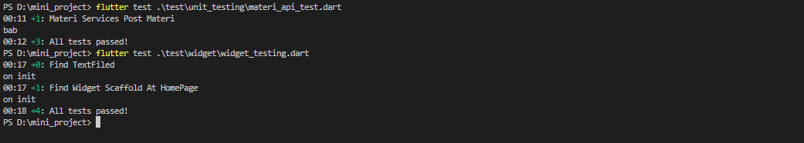

# mini_projeck

A new Flutter project.

## Getting Started
List update perbaikan mini project
```
Menyempurnakan fitur register

Future<bool> regis({
    required String email,
    required String password,
    required String nama,
    required String nisn,
    required String role,
  }) async {
    try {
      await _auth.createUserWithEmailAndPassword(
          email: email, password: password);
      await UserProvider().addUsers(nama, nisn, role);

      return true;
    } on FirebaseAuthException catch (e) {
      _error = e.message.toString();
    }
    return false;
  }
```

```
-Memisahkan antara materi provider dan materi services

class MateriServices {
  String baseUrl = 'https://mini-project-26683-default-rtdb.firebaseio.com/';

  Future<MateriModel> addMateri(
      String bab, String judul, String urlMateri) async {
    print(bab);
    Uri url = Uri.parse('$baseUrl/materi/$bab.json');
    try {
      var response = await http.post(
        url,
        body: json.encode({
          'judul': judul,
          'url': urlMateri,
        }),
      );

      if (response.statusCode > 300 || response.statusCode < 200) {
        throw (response.statusCode);
      } else {
        MateriModel data = MateriModel(
          id: json.decode(response.body)['judul'].toString(),
          judul: judul,
          url: urlMateri,
        );
        return MateriModel(
            id: json.decode(response.body)['judul'].toString(),
            judul: judul,
            url: urlMateri);
      }
    } catch (err) {
      throw (err);
    }
  }

  Stream<List<MateriModel>> inisialData(String kategory) async* {
    List<MateriModel> _allMateri = [];
    Uri url = Uri.parse('$baseUrl/materi/$kategory.json');

    try {
      var response = await http.get(url);

      print(response.statusCode);

      if (response.statusCode >= 300 && response.statusCode < 200) {
        throw (response.statusCode);
      } else {
        var data = json.decode(response.body) as Map<String, dynamic>;
        if (data != null) {
          data.forEach(
            (key, value) {
              _allMateri.add(MateriModel(
                  id: key, judul: value['judul'], url: value['url']));
            },
          );
        }
      }
      yield _allMateri;
    } catch (err) {
      throw (err);
    }
  }

  Future<void> deleteMateri(String id, String bab) {
    Uri url = Uri.parse('$baseUrl/materi/$bab/$id.json');
    return http.delete(url);
  }

  Future<void> editmateri(
      {required String id,
      required String judul,
      required String urlEdit,
      required String bab}) {
    Uri url = Uri.parse('$baseUrl/materi/$bab/$id.json');

    return http.put(
      url,
      body: json.encode(
        {
          'judul': judul,
          'url': urlEdit,
        },
      ),
    );
  }
}

class MateriProvider extends ChangeNotifier {
  List<MateriModel> _allMateri = [];
  List<MateriModel> get allMateri => _allMateri;

  Future<void> addMateri(String bab, String judul, String urlMateri) async {
    try {
      final result = await MateriServices().addMateri(bab, judul, urlMateri);
      if (result.id != null) {
        _allMateri.add(result);
        notifyListeners();
      }
    } catch (e) {
      rethrow;
    }
  }

  Future<void> deleteMateri(String id, String bab, String judul) async {
    try {
      final index = _allMateri.indexWhere((element) => element.judul == judul);
      if (index != null) {
        await MateriServices().deleteMateri(id, bab).then(
              (value) => _allMateri.removeAt(index),
            );
        print('succes');
      }
      notifyListeners();
    } catch (e) {
      print('gagal: $e');
    }
  }

  Future<void> editmateri(
      String id, String judul, String urlEdit, String bab) async {
    try {
      final index = _allMateri.indexWhere((element) => element.judul == judul);
      if (index != null) {
        await MateriServices()
            .editmateri(bab: bab, id: id, judul: judul, urlEdit: urlEdit);
      }
      notifyListeners();
    } catch (e) {
      print('gagal: $e');
    }
  }

  Future<void> getAllMateri(String kategori) async {
    await MateriServices().inisialData(kategori);
  }
}
```

Menyelesaikan Unit dan widget testing

